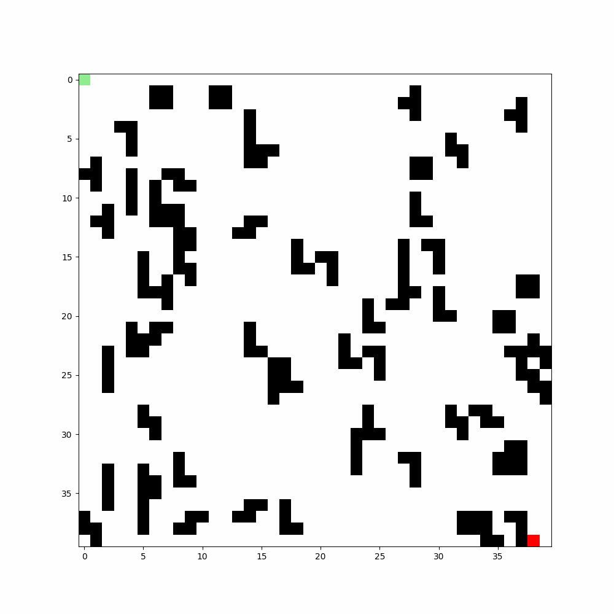
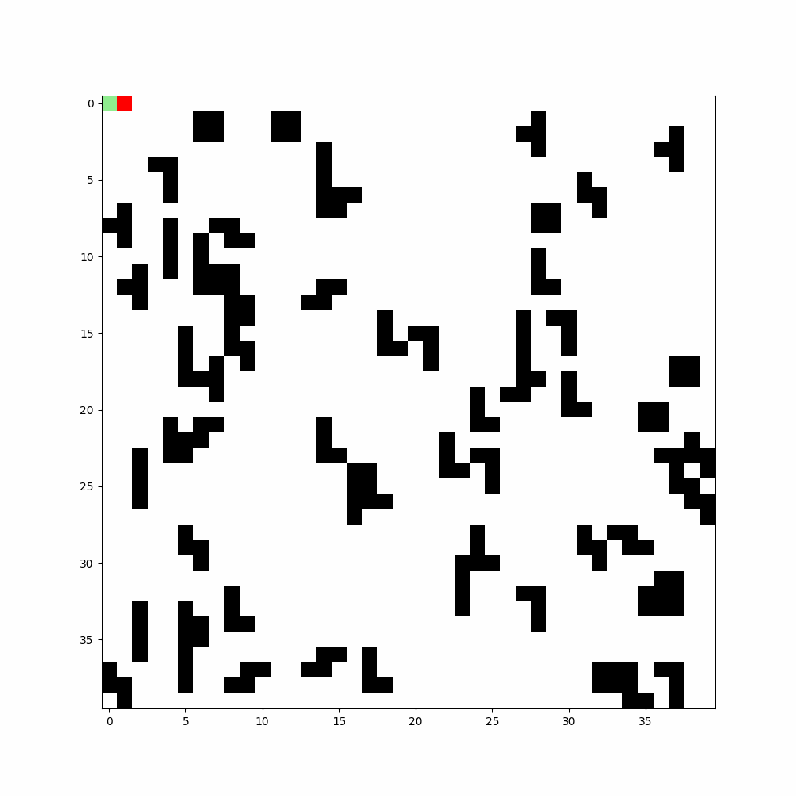
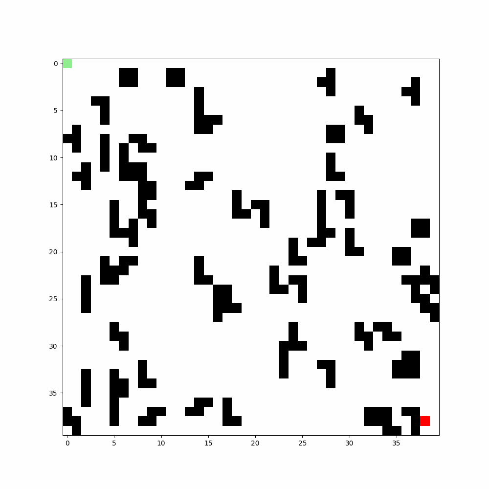

# Pathfinding Algorithms Visualization

This project demonstrates the implementation and visualization of various pathfinding algorithms: Depth-First Search (DFS), Breadth-First Search (BFS), A*, and Dijkstra’s Algorithm. Each algorithm is showcased with an interactive grid, and the pathfinding process is animated to demonstrate the exploration and final paths.

## Algorithms Implemented
- **Depth-First Search (DFS)**
- **Breadth-First Search (BFS)**
- **A_star Algorithm**
- **Dijkstra's Algorithm**

### How It Works
Each algorithm explores a grid to find the shortest path between a start point and an endpoint. Obstacles are placed randomly on the grid to simulate a real-world environment. The grid is visualized with:
- **White**: Free space
- **Black**: Obstacles
- **Green**: Explored nodes during the search
- **Red**: The final path found by the algorithm

### Features:
- Randomly generated grid with obstacles of varying shapes
- Animations to visualize the exploration and final path
- Supports grid size customization and obstacle percentage

## Visualizations

### Depth-First Search (DFS)
DFS explores each branch of the search tree as deeply as possible before backtracking. This often results in long and inefficient paths, but it is useful for exploring all possible nodes.



---

### Breadth-First Search (BFS)
BFS explores all nodes at the present depth level before moving on to nodes at the next depth level. It guarantees the shortest path in an unweighted grid.



---

### A* Algorithm
A* is a heuristic-based algorithm that finds the shortest path using a cost function `f(n) = g(n) + h(n)`, where:
- `g(n)` is the cost from the start to the current node
- `h(n)` is the estimated cost (heuristic) from the current node to the end node (using the Euclidean or Manhattan distance)


---

### Dijkstra's Algorithm
Dijkstra's Algorithm finds the shortest path between nodes in a graph by visiting all nodes in increasing order of distance. It is equivalent to A* without a heuristic function.



---


## Usage
You can create customize grid using obstacle.py from grids that takes following parameters:
- **Grid Size**: Specify the dimensions of the grid
- **Obstacle Percentage**: Adjust the density of obstacles on the grid
- **Algorithm Selection**: Choose the algorithm to visualize (DFS, BFS, A*, Dijkstra)

You can also adjust the FPS (frames per second) of the animation by modifying the `fps` and `skip_factor` parameter in the code.

## Example
```python
save_animation_video(grid, start_x, start_y, end_x, end_y)
```


